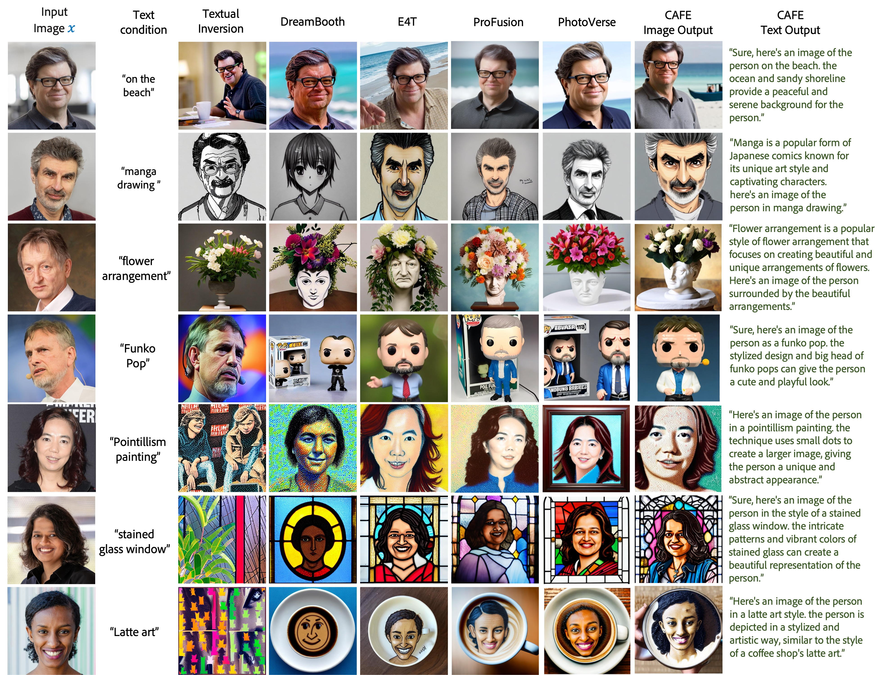
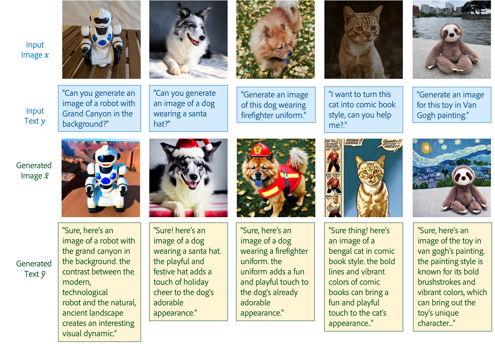
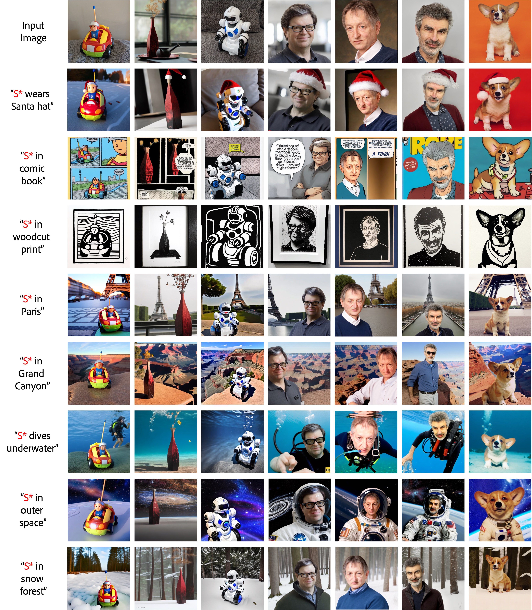
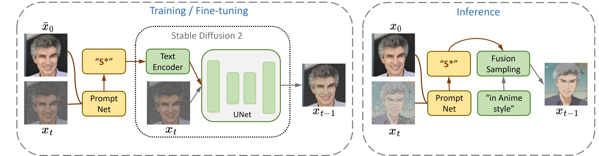

# ProFusion

ProFusion (with an encoder pre-trained on a large dataset such as [CC3M](https://ai.google.com/research/ConceptualCaptions/)) can be used to efficiently construct customization dataset, which can be used to train a tuning-free customization assistant ([CAFE](https://arxiv.org/abs/2312.03045)).

Given a testing image, the assistant can perform customized generation in a tuning-free manner. It can take complex user-input, generate text explanation and elaboration along with image, without any fine-tuning.

 

  

 Results from CAFE 

 

 

  

 Results from CAFE 

 

-----------------------------
Code for [Enhancing Detail Preservation for Customized Text-to-Image Generation: A Regularization-Free Approach](https://arxiv.org/abs/2305.13579).

 

  

 Results from ProFusion 

 

ProFusion is a framework for customizing pre-trained large-scale text-to-image generation models, which is [Stable Diffusion 2](https://github.com/Stability-AI/stablediffusion) in our examples.
 

  

 Illustration of the proposed ProFusion 

 

With ProFusion, you can generate infinite number of creative images for a novel/unique concept, with single testing image, on single GPU (~20GB are needed when fine-tune with batch size 1).

 

  

 Results from ProFusion 

 

## Example

- Install dependencies (we revised original [diffusers](https://github.com/huggingface/diffusers));

        cd ./diffusers
        pip install -e .
        cd ..
        pip install accelerate==0.16.0 torchvision transformers==4.25.1 datasets ftfy tensorboard Jinja2 regex tqdm joblib 

- Initialize [Accelerate](https://github.com/huggingface/accelerate/);

        accelerate config

- Download a model [pre-trained on FFHQ](https://drive.google.com/file/d/1n6jZXpb2nE_ptftKjSr7JZ22TsCbZHCh/view?usp=share_link);

- Customize model with a testing image, example is shown in the notebook [test.ipynb](./test.ipynb);

## Train Your Own Encoder

If you want to train a PromptNet encoder for other domains, or on your own dataset.

- First, prepare an image-only dataset; 
    - In our example, we use [FFHQ](https://github.com/NVlabs/ffhq-dataset). Our pre-processed FFHQ can be found at [google drive link](https://drive.google.com/file/d/1cObckM1omlMgG5x1z9sMGqbrgCKNkPhu/view?usp=share_link).

- Then, run
    
        accelerate launch --mixed_precision="fp16" train.py\
              --pretrained_model_name_or_path="stabilityai/stable-diffusion-2-base" \
              --train_data_dir=./images_512 \
              --max_train_steps=80000 \
              --learning_rate=2e-05 \
              --output_dir="./promptnet" \
              --train_batch_size=8 \
              --promptnet_l2_reg=0.000 \
              --gradient_checkpointing

## Citation

    @article{zhou2023enhancing,
      title={Enhancing Detail Preservation for Customized Text-to-Image Generation: A Regularization-Free Approach},
      author={Zhou, Yufan and Zhang, Ruiyi and Sun, Tong and Xu, Jinhui},
      journal={arXiv preprint arXiv:2305.13579},
      year={2023}
    }

